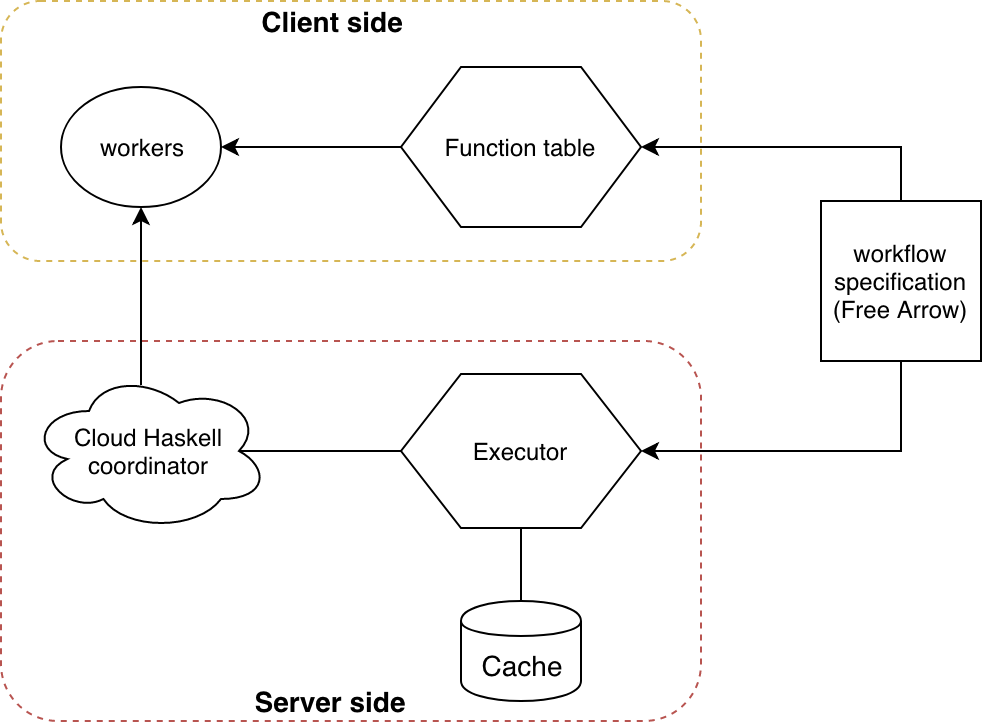

Scientific workflow management system
=====================================

SciFlow is a DSL for building type-safe computational workflows.
SciFlow is implemented based on the Free Arrow and is heavily inspired by the funflow package.
The differences between SciFlow and funflow are:

1. SciFlow uses Template Haskell to ease the process of workflow specification and to allow composition and reuse of defined workflows.

2. SciFlow supports distributed computing thanks to Cloud Haskell!

Features
--------

1. Easy to use and safe: Provide a simple and flexible way to design type safe
computational pipelines in Haskell.

2. Automatic Checkpointing: The states of intermediate steps are automatically
logged, allowing easy restart upon failures.

3. Parallelism and distributed computing support.

Examples
--------

See examples in the "examples" directory for more details.

Featured applications
--------------------

[Here](https://github.com/Taiji-pipeline)
are some bioinformatics pipelines built with SciFlow.
