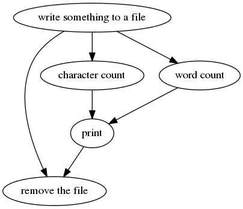

Scientific workflow management system
=====================================

A scientific workflow is a series of computational steps which usually can be presented as a Directed Acyclic Graph (DAG).

SciFlow is to help programmers design complex workflows with ease. Here is a trivial example. (Since we use template haskell, we need to divide this small program into two parts.)

```haskell
---------------------------------------------------
-- File 1: MyModule.hs
---------------------------------------------------
{-# LANGUAGE OverloadedStrings #-}
{-# LANGUAGE TemplateHaskell #-}
module Functions
    (builder) where

import Control.Lens ((^.), (.=))
import qualified Data.Text as T
import Shelly hiding (FilePath)
import Text.Printf (printf)

import Scientific.Workflow

create :: () -> IO FilePath
create _ = do
    writeFile "hello.txt" "hello world"
    return "hello.txt"

countWords :: FilePath -> IO Int
countWords fl = do
    content <- readFile fl
    return $ length $ words content

countChars :: FilePath -> IO Int
countChars fl = do
    content <- readFile fl
    return $ sum $ map length $ words content

output :: (Int, Int) -> IO Bool
output (ws, cs) = do
    putStrLn $ printf "Number of words: %d" ws
    putStrLn $ printf "Number of characters: %d" cs
    return True

cleanUp :: (Bool, FilePath) -> IO ()
cleanUp (toBeRemoved, fl) = if toBeRemoved
    then shelly $ rm $ fromText $ T.pack fl
    else return ()

-- builder monad
builder :: Builder ()
builder = do
    node "step0" 'create $ label .= "write something to a file"
    node "step1" 'countWords $ label .= "word count"
    node "step2" 'countChars $ label .= "character count"
    node "step3" 'output $ label .= "print"
    node "step4" 'cleanUp $ label .= "remove the file"

    ["step0"] ~> "step1"
    ["step0"] ~> "step2"
    ["step1", "step2"] ~> "step3"
    ["step3", "step0"] ~> "step4"

---------------------------------------------------
-- File 2: main.hs
---------------------------------------------------
{-# LANGUAGE TemplateHaskell #-}

import System.Environment

import qualified Functions as F
import qualified Data.Text.Lazy.IO as T

import Scientific.Workflow
import Scientific.Workflow.Visualize

buildWorkflow "wf" F.builder

main :: IO ()
main = do
    (cmd:args) <- getArgs
    case cmd of
        "run" -> runWorkflow wf def
        "view" -> T.putStrLn $ renderBuilder F.builder
```

The workflow can be visualized by running `runghc main.hs view | dot -Tpng > example.png`.



To run the workflow, simply type `runghc main.hs run`. The program will create a directory to store results of each step. If being terminated prematurely, the program will use the saved data to continue from the last step.
